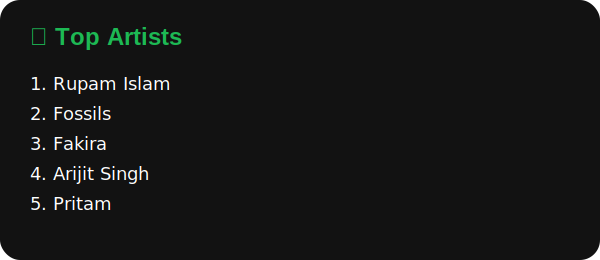
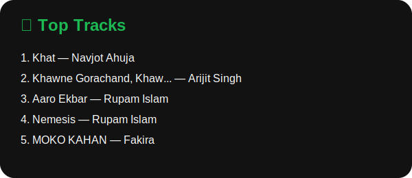
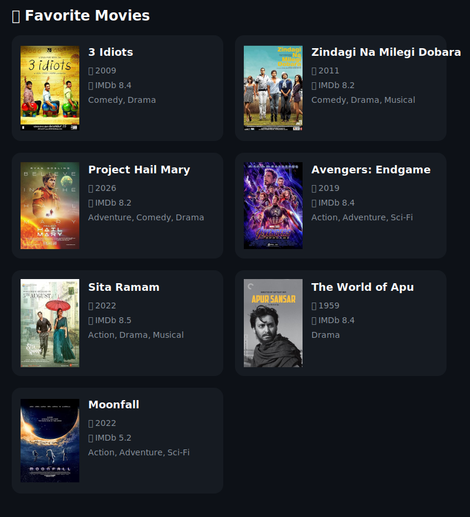

  

  
  
  
  
  
  
  
  
  
  
  
  
  
  
  
  
  
  
  
  
  
  
  
  
  
  
  
  
  
  
  

<h2 align="center">📊 GitHub Analytics</h2>

  
  

  

  

  

  

<h2 align="center">🎵 Currently Listening To</h2>

  

  
  

  

<h2 align="center">🐍 Watch the Snake Eat My Contributions!</h2>

  

<h2 align="center">📫 Connect With Me</h2>

  

